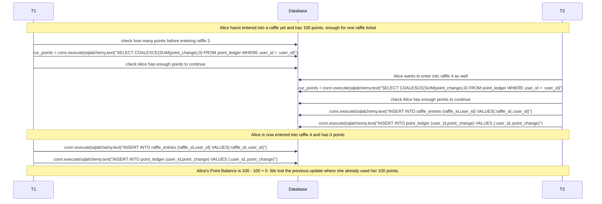

```mermaid
sequenceDiagram
     participant T1
    participant Database
    participant T2
    Note over T1, T2: Alice hasnt entered into a raffle yet and has 100 points, enough for one raffle ticket
    T1->>Database: check how many points before entering raffle 3
    T1->>Database: cur_points = conn.execute(sqlalchemy.text("SELECT COALESCE(SUM(point_change),0) FROM point_ledger WHERE user_id = :user_id)");
    T1->>Database: check Alice has enough points to continue
    T2->>Database: Alice wants to enter into raffle 4 as well
    T2->>Database: cur_points = conn.execute(sqlalchemy.text("SELECT COALESCE(SUM(point_change),0) FROM point_ledger WHERE user_id = :user_id)");
    T2->>Database: check Alice has enough points to continue
    T2->>Database: conn.execute(sqlalchemy.text("INSERT INTO raffle_entries (raffle_id,user_id) VALUES(:raffle_id,:user_id)");
    T2->>Database: conn.execute(sqlalchemy.text("INSERT INTO point_ledger (user_id,point_change) VALUES (:user_id,:point_change)");
    Note over T1, T2: Alice is now entered into raffle 4 and has 0 points
    T1->>Database: conn.execute(sqlalchemy.text("INSERT INTO raffle_entries (raffle_id,user_id) VALUES(:raffle_id,:user_id)");
    T1->>Database: conn.execute(sqlalchemy.text("INSERT INTO point_ledger (user_id,point_change) VALUES (:user_id,:point_change)");
    Note over T1, T2: Alice's Point Balance is 100 - 100 = 0. We lost the previous update where she already used her 100 points.
```
