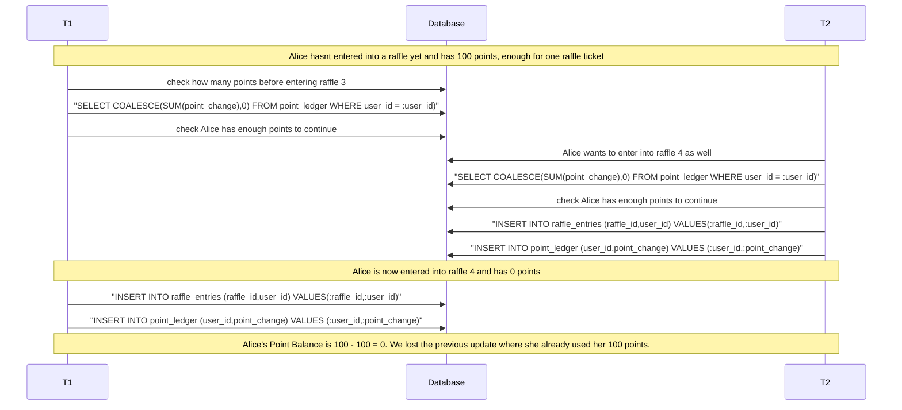
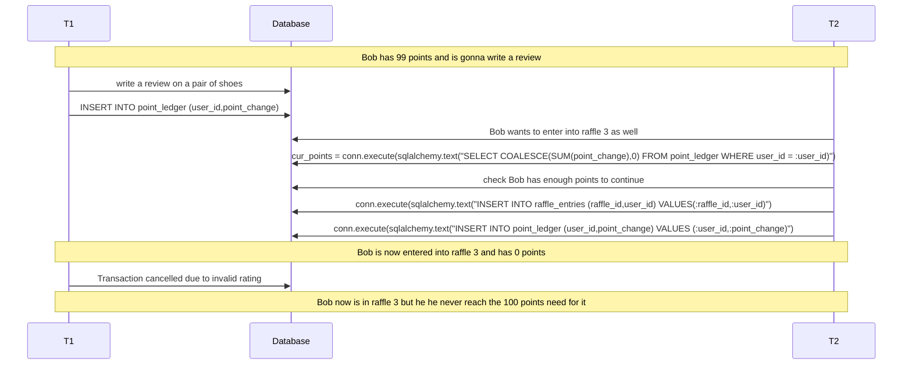
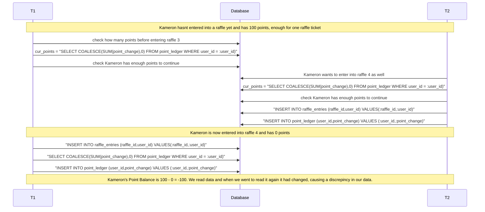

# Lost Update

This diagram shows how T1 read a data item and then T2 updates the data item, then T1 (based on its earlier read value) updates the data item and commits. to ensure that this doesnt happen, we use Atomic Operations that encompass all the steps needed to update the data so there is no way for this phenomena to happen. This works because it makes sure that either all operations go through, or none.

# Dirty Read

This diagram shows how T1 wrote data uncommitted and then T2 read that uncommitted data and did stuff with it. But T1 then fails and the uncommitted data was read but it actually never should have existed. To prevent this we use Transactions and keep them Atomic so that if one part of the transaction fails none of it gets written. This solves it because it ensures isolation between each call.

# Non Repeatable read

This diagram shows how T1 read the same row twice and gots a different value each time. We solved this issue by keeping all our commands in the same transaction. This solves it because it ensures isolation between each call.

